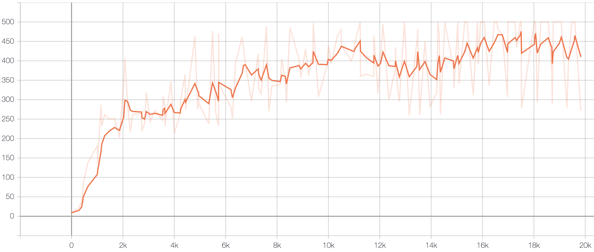

# muzero-pytorch
Pytorch Implementation of MuZero : "[Mastering Atari , Go, Chess and Shogi by Planning with a Learned Model](https://arxiv.org/pdf/1911.08265.pdf)"  based on [pseudo-code](https://arxiv.org/src/1911.08265v1/anc/pseudocode.py) provided by the authors

_Note: This implementation has just been tested on CartPole-v1 and would required modifications(`in config folder`) for other environments_

### Installation
```bash
cd muzero-pytorch
pip install -r requirements.txt
```

### Usage:
* Train: ```python main.py --env CartPole-v1 --case classic_control --opr train --force```
* Test: ```python main.py --env CartPole-v1 --case classic_control --opr test```
* Visualize results : ```tensorboard --logdir=<result_dir_path>```

|Required Arguments | Description|
|:-------------|:-------------|
| `--env`|             Name of the environment|
| `--case {atari,classic_control}` |It's used for switching between different domains(default: None)|
| `--opr {train,test}` | select the operation to be performed|

|Optional Arguments | Description|
|:-------------|:-------------|
| `--value_loss_coeff` |    scale for value loss (default: None)|
| `--revisit_policy_search_rate` |Rate at which target policy is re-estimated (default:None)|
| `--use_max_priority`    | Forces max priority assignment for new incoming data in replay buffer (only valid if no_priority=False) (default: False) |
| `--no_priority`         | Forces Uniform data sampling in replay buffer (default: False)|
| `--no_target_model`     | Doesn't use target model for bootstrap value estimation (default: False)|
| `--result_dir` | Directory Path to store results |
| `--no_cuda`           |  no cuda usage (default: False)|
| `--debug`              | If enables, logs gradient of the network (default:False)|
| `--render`             | Renders the environment (default: False)|
| `--force`             |  Overrides past results (default: False)|
| `--seed`            |seed (default: 0)|
| `--test_episodes` |Evaluation episode count (default: 10)|


### CartPole-v1 Result
- Curves represents model evaluation for 5 episodes at 100 step training interval. 
- Also, each curve has mean scores over 3 runs (seeds : [0,100,200])

||
|--|
||
||


